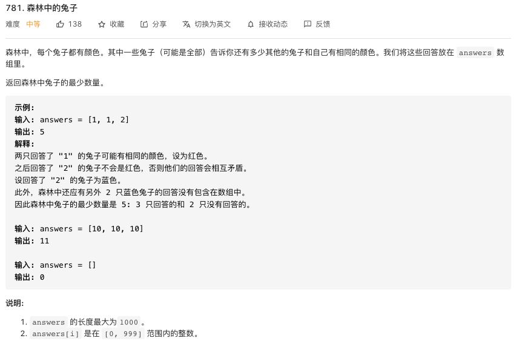

# 树

通常，我们可以通过 “自顶向下” 或 “自底向上” 的递归来解决树问题。

- **“自顶向下” 的解决方案**

**意味着在每个递归层级，我们将首先访问节点来计算一些值，并在递归调用函数时将这些值传递到子节点（先序遍历）**。一般的模版：

```java
1.if(如果节点是空 | 递归中止条件) {return ...}
2.update root value;  // 根节点的处理逻辑 
3.left_value = top_down(root.left, left_param); //左递归
4.right_value = top_down(root.right, right_param); //右递归
5. return answer 
```

比如：寻找二叉树的最大深度。运用"自顶向下"如何解决？我们知道如果每个节点知道其父节点的深度，那么子节点的深度 = 父节点深度 + 1，所以:

```java
int answer;		       // don't forget to initialize answer before call maximum_depth
void maximum_depth(TreeNode* root, int depth) {
    if (!root) {
        return;
    }
    if (!root->left && !root->right) {
        answer = max(answer, depth);
    }
    maximum_depth(root->left, depth + 1);
    maximum_depth(root->right, depth + 1);
}
```

- **"自地向上"的解决方案**

**在每个递归层次上，我们首先对所有子节点递归地调用函数，然后根据返回值和根节点本身的值得到答案（后序遍历）**。一般的模版是：

```java
1. if(如果节点是空 | 递归中止条件) {return ...}
2. left_ans = bottom_up(root.left)			// call function recursively for left child
3. right_ans = bottom_up(root.right)		// call function recursively for right child
4. return answers   
```

还是二叉树的深度，看看后序遍历是如何做的：

```java
int maximum_depth(TreeNode* root) {
	if (!root) {
		return 0;                                 // return 0 for null node
	}
	int left_depth = maximum_depth(root->left);
	int right_depth = maximum_depth(root->right);
	return max(left_depth, right_depth) + 1;	  // return depth of the subtree rooted at root
}
```


# 贪心算法

## 781.森林中的兔子【数学公式？】



官方题解：https://leetcode-cn.com/problems/rabbits-in-forest/solution/sen-lin-zhong-de-tu-zi-by-leetcode-solut-kvla/


# 动态规划

