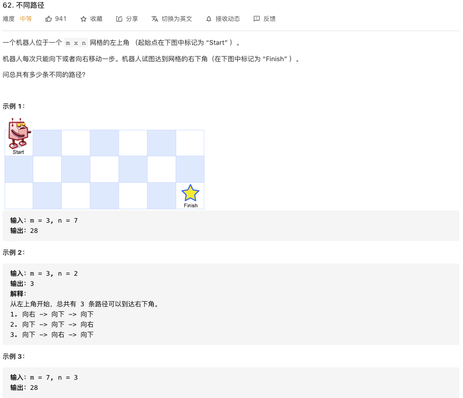
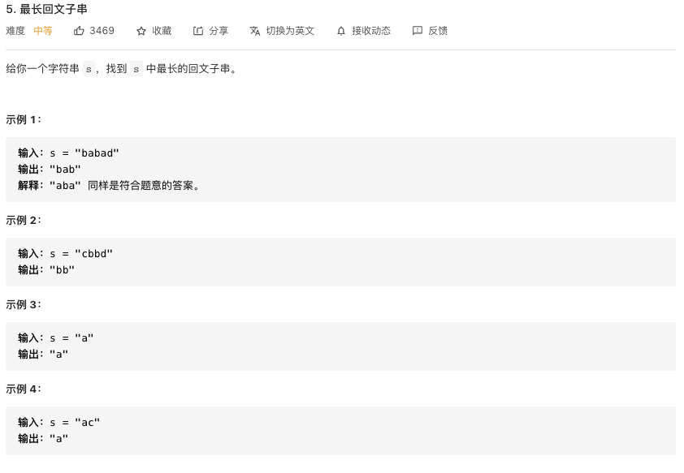
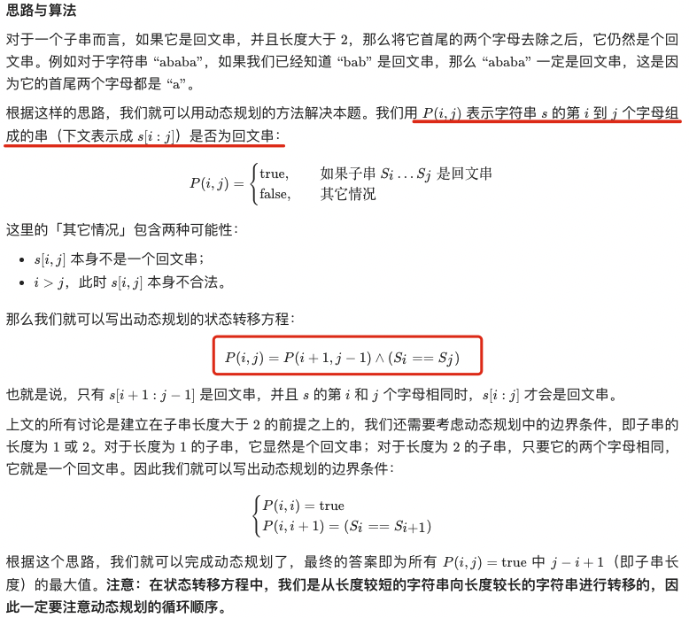
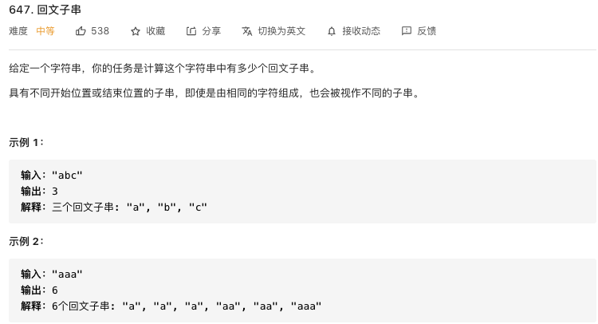
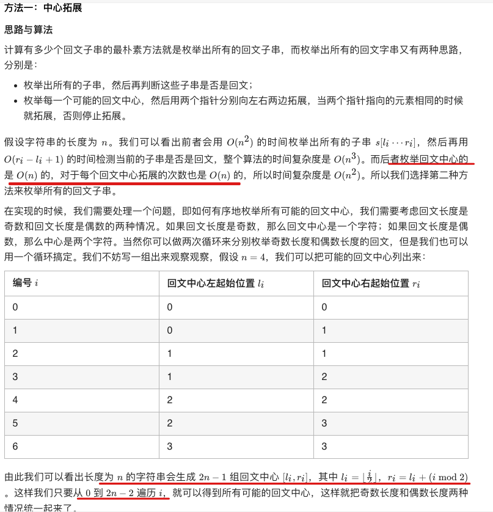
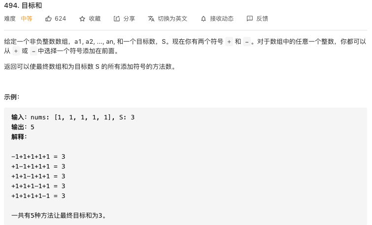
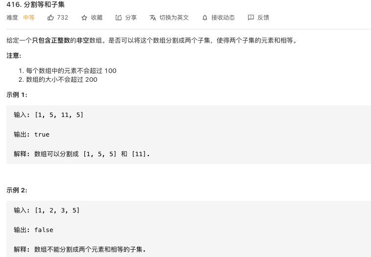
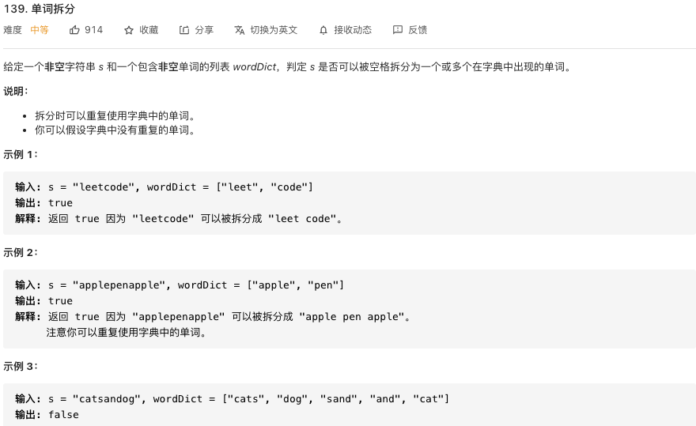

# 高频面试题

## 146.手写LRU算法



```java
class LRUCache {

   private class CacheNode {
       CacheNode pre;
       CacheNode next;
       int key;
       int value;

       CacheNode(int key, int value) {
           this.key = key;
           this.value = value;
           this.pre = null;
           this.next = null;
       }
    }

    private int capacity;
    Map<Integer, CacheNode> cacheMap = new HashMap<>();
    CacheNode head = new CacheNode(-1, -1);
    CacheNode tail = new CacheNode(-1, -1);

    public LRUCache(int capacity) {
        this.capacity = capacity;
        tail.pre = head;
        head.next = tail;
    }

    public int get(int key) {
        if(!cacheMap.containsKey(key)) {
            return -1;
        }

        CacheNode currentNode = cacheMap.get(key);
        //将使用后的数据移动到链表的极为
        currentNode.next.pre = currentNode.pre;
        currentNode.pre.next = currentNode.next;
        moveToTail(currentNode);
        return currentNode.value;
    }

    /**
     * 移动节点到链表的尾部
     * @param currentNode
     */
    private void moveToTail(CacheNode currentNode) {
        currentNode.pre = tail.pre;
        currentNode.pre.next = currentNode;
        tail.pre = currentNode;
        currentNode.next = tail;
    }

    public void put(int key, int value) {
        // 数据存在更新最新值
        if(get(key) != -1) {
            cacheMap.get(key).value = value;
            return;
        }

        //缓存数据达到上限，删除最近最少使用数据
        if(cacheMap.size() == capacity) {
            //删除最近最少使用的数据
            cacheMap.remove(head.next.key);
            head.next = head.next.next;
            head.next.pre = head;
        }
        
        //数据不存在，直接插入到链表的尾部
        CacheNode insertNode = new CacheNode(key, value);
        cacheMap.put(key, insertNode);
        moveToTail(insertNode);
    }
}
```


# 树

通常，我们可以通过 “自顶向下” 或 “自底向上” 的递归来解决树问题。

- **“自顶向下” 的解决方案**

**意味着在每个递归层级，我们将首先访问节点来计算一些值，并在递归调用函数时将这些值传递到子节点（先序遍历）**。一般的模版：

```java
1.if(如果节点是空 | 递归中止条件) {return ...}
2.update root value;  // 根节点的处理逻辑 
3.left_value = top_down(root.left, left_param); //左递归
4.right_value = top_down(root.right, right_param); //右递归
5. return answer 
```

比如：寻找二叉树的最大深度。运用"自顶向下"如何解决？我们知道如果每个节点知道其父节点的深度，那么子节点的深度 = 父节点深度 + 1，所以:

```java
int answer;		       // don't forget to initialize answer before call maximum_depth
void maximum_depth(TreeNode* root, int depth) {
    if (!root) {
        return;
    }
    if (!root->left && !root->right) {
        answer = max(answer, depth);
    }
    maximum_depth(root->left, depth + 1);
    maximum_depth(root->right, depth + 1);
}
```

- **"自地向上"的解决方案**

**在每个递归层次上，我们首先对所有子节点递归地调用函数，然后根据返回值和根节点本身的值得到答案（后序遍历）**。一般的模版是：

```java
1. if(如果节点是空 | 递归中止条件) {return ...}
2. left_ans = bottom_up(root.left)			// call function recursively for left child
3. right_ans = bottom_up(root.right)		// call function recursively for right child
4. return answers   
```

还是二叉树的深度，看看后序遍历是如何做的：

```java
int maximum_depth(TreeNode* root) {
	if (!root) {
		return 0;                                 // return 0 for null node
	}
	int left_depth = maximum_depth(root->left);
	int right_depth = maximum_depth(root->right);
	return max(left_depth, right_depth) + 1;	  // return depth of the subtree rooted at root
}
```

## 深序遍历 (DFS)

### 104.二叉树的深度


```java
//自底向上的递归
class Solution {
    public int maxDepth(TreeNode root) {
        if(root == null) {
            return 0;
        }
        return Math.max(maxDepth(root.left) + 1, maxDepth(root.right) + 1);
    }
}

//
```


### 110.是否是平衡二叉树


**注意：这里说的是每个节点的，容易陷入的思维误区是：认为只需要判断根节点的左子树高度和右子树高度差，下面举一个反面的例子，如图：**


```java
class Solution {
    public boolean isBalanced(TreeNode root) {
        if(root == null) {
            return  true;
        }
        //计算左右子树的高度
        int leftDepth = treeDepth(root.left);
        int rightDepth = treeDepth(root.right);

        if( Math.abs(leftDepth - rightDepth) > 1){
           return false;
       }
       //递归的判断每个节点
       return isBalanced(root.left) && isBalanced(root.right);
    }

    private int treeDepth(TreeNode root) {
        if(root == null) {
            return 0;
        }
        int leftDepth = treeDepth(root.left) + 1;
        int rightDepth = treeDepth(root.right) + 1;
        return Math.max(leftDepth, rightDepth);
    }
}
```


### 101. 对称二叉树


两个树如何称为镜像：

- 根节点的值相同
- 每个根节点的左孩子与另外一个树的右孩子相同
- 同理每个根节点的右孩子与另外一个树的左孩子相同

```java
lass Solution {
    public boolean isSymmetric(TreeNode root) {
        return symmetric(root, root);
    }

    //使用两个指针同步遍历整个树
    private boolean symmetric(TreeNode leftRoot, TreeNode rightRoot) {
        // 递归终止条件
        if (leftRoot == null && rightRoot == null) {
            return true;
        }
        if (leftRoot == null || rightRoot == null){
            return false;
        }

        return leftRoot.val == rightRoot.val && symmetric(leftRoot.left, rightRoot.right) && symmetric(leftRoot.right, rightRoot.left);
    }
}
```

复杂度分析：

- 时间复杂度：相当与整个树的节点都遍历了一遍，时间复杂度O(n)
- 空间复杂度：相当于整个树的高度，最坏情况下，树为链表，所以空间复杂度O（n）

### 235.二叉搜索树的最近公共祖先


有三种情况：

- p和q同时在root的左子树
- p和q同时在root的右子树
- p和q一个在root的左边一个在root的右边

```java
//抽象逻辑：这里有三种情况
public TreeNode lowestCommonAncestor(TreeNode root, TreeNode p, TreeNode q) {
    
    //首先保证p和q存在于二叉树中
    assert(p != null && q != null);
   
    //root为null的处理
    if(root == null)
        return null;
    
    //情况1：p和q同时在root的左子树
    if(p.val < root.val && q.val < root.val )
        return lowestCommonAncestor(root.left, p ,q);      
    //情况2：p和q同时在root的右子树
    if(p.val > root.val && q.val > root.val )
        return lowestCommonAncestor(root.right,p,q);
   
    //情况3：排除上面的两种，说明p和q一个在root的左边一个在root的右边，所以root就是他们最近的公共父节点
    return root;
}
```

### 112. 路径和


```java
class Solution {
    public boolean hasPathSum(TreeNode root, int sum) {
        if( root == null ) {
            return false;
        }
       if(root.left == null && root.right == null) {
           return root.val == sum;
       }
       return hasPathSum(root.left, sum-root.val) || hasPathSum(root.right, sum - root.val);
    }
}
```

### 113. 路径和II


```java
//使用记忆化的DFS来解决
class Solution {
public:
    vector<vector<int> > FindPath(TreeNode* root,int expectNumber) {
        vector<vector<int>> ret;
        vector<int> trace;
        if(root)
            dfs(root,expectNumber,ret,trace);
        return ret;
    }
   void dfs(TreeNode* root,int s,vector<vector<int>> &ret,vector<int> &trace) {
        trace.push_back(root->val);
        //遍历到根节点，并且找到一条合适的路径，将路径添加到集合中
        if(!root->left&&!root->right) {
            if(s==root->val)
                ret.push_back(trace);
        }
        if(root->left)
            dfs(root->left,s-root->val,ret,trace);
        if(root->right)
            dfs(root->right,s-root->val,ret,trace);
        //如果路径中的值不合适要，递归回来时，路径值也要退出来
        trace.pop_back();
    }
};
```

### 437.路径和III


回顾之前求解路径之和的过程，递归的过程是判断左孩子和右孩子路径中是否存在路径和等于**sum-root.val**，这就意味着我们**默认当前的节点就是在这个路径上的**。

可以对于这个问题就不是这样了，对于每个节点分两种情况考虑，在这个节点在这个路径和不在这个路径上。

- **如果node在这个路径上**，我们可以设置一个新函数，他的做法和之前求路径和做法是一样的，就是在其左右子树中求**和为****sum-node.val**的节点
- **如果node不在这个路径上**，此时的目标就是在左右节点上寻找**和为sun**的路径。

```java
//以root为根节点的二叉树中，寻找和为sum的路径，返回这样的路径的个数
public int pathSum(TreeNode root, int sum) {
    if(root == null){
       return 0;
    }
    
    //节点在路径上的情况
    int res = findPath(root,sum);
    
    //节点没有在路径上，需要排除该节点
    res += pathSum(root.left,sum);
    res += pathSum(root.right,sum); 
    return res;
}

//在以node为根节点的二叉树中，寻找包含node的路径，和为sum，返回这样的路径个数
private int findPath(TreeNode node,int num){
    if(node == null)
        return 0;
    //存放返回值
    int res = 0;
    
    //注意这是个陷阱：因为节点数据可能含有负数，即使找到了一个，如果存在负数的情况，后续还有可能出现路径和为sum的情况
    if(node.val==num)
        res += 1;
    
    
    res += findPath(node.left,num-node.val);
    res += findPath(node.right,num-node.val);
    
    return res;
}
```

### 230. 二叉搜索树第K小元素


**思路一： 中序遍历，找到第K个就行（二叉搜索树中序遍历，就是个升序数组）**

```c++
class Solution {
public:
    int kthSmallest(TreeNode* root, int k) {
        int res = 0, cnt = 0;
        inorder(root, res, k, cnt);
        return res;
    }
    int inorder(TreeNode* root, int& res, int k, int& i)
    {
        if(root == nullptr)
            return 0;
        if(!inorder(root->left, res, k, i))
        {
            i++;
            if(i == k)
            {
                res = root->val;
                return 1;
            }
            return inorder(root->right, res, k, i);
        }
        return 1;
    }
};
```

**思路二：统计左子树的结点个数leftsize**

- **leftsize+1 == size ,根节点就是第K个元素**
- **left>k , 第K个元素在左子树中**
- **left+1<k，左子树中没有，在右子树中寻找K-left-1元素**

```c++
class Solution {
    public int kthSmallest(TreeNode root, int k) {
        if(root == null)
            return 0;
        
        int leftsize = calTreeSize(root.left);
        if(k == leftsize+1)
            return root.val;
        else if(leftsize >= k)
            return kthSmallest(root.left,k);
        else 
            return kthSmallest(root.right,k-leftsize-1);
    }
    
    private int calTreeSize(TreeNode root){
        if(root == null)
            return 0;
        return 1+calTreeSize(root.left) + calTreeSize(root.right);
    }
}
```


## 二叉树的还原

### 105.根据前序和中序还原二叉树


对于任意一颗树而言，前序和中序遍历的形式总是:

```
[ 根节点, [左子树的前序遍历结果], [右子树的前序遍历结果] ]
[ [左子树的中序遍历结果], 根节点, [右子树的中序遍历结果] ]
```

只要从中序遍历的结果中定位到“根结点”，我们就行确定左子树和右子树的节点数目（因为前序和中序遍历结果长度一定是相同的），然后根据左子树的前序和中序结果还原左子树，明显这是个递归的过程，同理右子树也是同样的道理....

为了能够快速的从中序遍历的结果中定位到根结点的位置，我们可以使用“空间换时间”的思路，使用HashMap来保存中序遍历的每个值何其对应位置的对应关系。


```java
class Solution {
    private Map<Integer, Integer> indexMap;
    
    public TreeNode buildTree(int[] preorder, int[] inorder) {
        int n = preorder.length;
        // 构造哈希映射，帮助我们快速定位根节点
        indexMap = new HashMap<Integer, Integer>();
        for (int i = 0; i < n; i++) {
            indexMap.put(inorder[i], i);
        }
        return myBuildTree(preorder, inorder, 0, n - 1, 0, n - 1);
    }
    
    
    public TreeNode myBuildTree(int[] preorder, int[] inorder, int preorder_left, int preorder_right, int inorder_left, int inorder_right) {
        if (preorder_left > preorder_right) {
            return null;
        }

        // 前序遍历中的第一个节点就是根节点
        int preorder_root = preorder_left;
        // 在中序遍历中定位根节点
        int inorder_root = indexMap.get(preorder[preorder_root]);
        
        // 先把根节点建立出来
        TreeNode root = new TreeNode(preorder[preorder_root]);
        // 得到左子树中的节点数目
        int size_left_subtree = inorder_root - inorder_left;
        // 递归地构造左子树，并连接到根节点
        // 先序遍历中「从 左边界+1 开始的 size_left_subtree」个元素就对应了中序遍历中「从 左边界 开始到 根节点定位-1」的元素
        root.left = myBuildTree(preorder, inorder, preorder_left + 1, preorder_left + size_left_subtree, inorder_left, inorder_root - 1);
        // 递归地构造右子树，并连接到根节点
        // 先序遍历中「从 左边界+1+左子树节点数目 开始到 右边界」的元素就对应了中序遍历中「从 根节点定位+1 到 右边界」的元素
        root.right = myBuildTree(preorder, inorder, preorder_left + size_left_subtree + 1, preorder_right, inorder_root + 1, inorder_right);
        return root;
    }
}
```


### 106.根据中序和后序还原二叉树


递归解法：

```java


class Solution {
    HashMap<Integer,Integer> memo = new HashMap<>();
    int[] post;

    public TreeNode buildTree(int[] inorder, int[] postorder) {
        for(int i = 0;i < inorder.length; i++) memo.put(inorder[i], i);
        post = postorder;
        TreeNode root = buildTree(0, inorder.length - 1, 0, post.length - 1);
        return root;
    }

    public TreeNode buildTree(int is, int ie, int ps, int pe) {
        if(ie < is || pe < ps) return null;

        int root = post[pe];
        int ri = memo.get(root);

        TreeNode node = new TreeNode(root);
        node.left = buildTree(is, ri - 1, ps, ps + ri - is - 1);
        node.right = buildTree(ri + 1, ie, ps + ri - is, pe - 1);
        return node;
    }
}
```

# 双指针

## 快慢指针

### 判断链表是否有环


### 寻找有环链表的起点


## 碰撞指针


# BFS

## BFS 模板

```java
void bfs(TreeNode root){
    Queue<TreeNode> queue = ArrayQueue<>();
    queue.add(root);
    
    while( !queue.isEmpty ) {
        TreeNode node = queue.poll();
        if (node.left != null) {
            queue.add(node.left);
        }
        if (node.right != null) {
            queue.add(node.right);
        }
    }
}
```


## BFS应用

### 102.层序遍历


```java
public List<List<Integer>> levelOrder(TreeNode root) {
    List<List<Integer>> res = new ArrayList<>();

    Queue<TreeNode> queue = new ArrayDeque<>();
    if (root != null) {
        queue.add(root);
    }
    while (!queue.isEmpty()) {
        //这块层掉入坑中
        int n = queue.size();
        List<Integer> level = new ArrayList<>();
        
        //错误的写法：for(int i = 0; i < queue.size(); i++)
        for (int i = 0; i < n; i++) { 
            TreeNode node = queue.poll();
            level.add(node.val);
            if (node.left != null) {
                queue.add(node.left);
            }
            if (node.right != null) {
                queue.add(node.right);
            }
        }
        res.add(level);
    }
    return res;
}
```

### 107.层序遍历II


二叉树的层序遍历思想：**如果要求从上到下输出每一层的节点值，在遍历完一层节点之后，将存储该层节点值的列表添加到结果列表的尾部**。 如果 **从下到上输出每一层的节点值，在遍历完一层节点之后，将存储该层节点值的列表添加到结果列表的头部** 

```java
class Solution {
    public List<List<Integer>> levelOrderBottom(TreeNode root) {
        List<List<Integer>> levelOrder = new LinkedList<List<Integer>>();
        if (root == null) {
            return levelOrder;
        }
        Queue<TreeNode> queue = new LinkedList<TreeNode>();
        queue.offer(root);
        while (!queue.isEmpty()) {
            List<Integer> level = new ArrayList<Integer>();
            int size = queue.size();
            for (int i = 0; i < size; i++) {
                TreeNode node = queue.poll();
                level.add(node.val);
                TreeNode left = node.left, right = node.right;
                if (left != null) {
                    queue.offer(left);
                }
                if (right != null) {
                    queue.offer(right);
                }
            }
            //LinkedList(链表), 添加时指定index = 0, 每次都是头插 
            levelOrder.add(0, level);
        }
        return levelOrder;
    }
}
```


# 贪心算法

## 781.森林中的兔子【数学公式？】


官方题解：https://leetcode-cn.com/problems/rabbits-in-forest/solution/sen-lin-zhong-de-tu-zi-by-leetcode-solut-kvla/


# 动态规划

## 题解

### 343. 整数拆分


思路：

- 首先不知道一个数能分割成多少份，所以不能采用循环的思路，只能采用递归的思路
- 如何枚举出一个数拆分的所有可能呢？
- 注意，要求是“至少”拆分成两个正整数的和，也就是说对于n，也可以只将n分割成i和(n-i)


**方法一：暴力解法**

从上面的拆分可以看出，如果使用`F(n)`表示分割n获取的最大乘机，我们不难得到一个公式：

`F(n)=max{i∗F(n−i)}，i=1，2，...，n−1`

但是如果`(n-i)`已经比`F(n-i)`大的话，我们就没有必要继续拆分`F(n-i)`，故可以将`F(N)`改写成

`F(n)=max{i*(n-i), i∗F(n−i)}，i=1，2，...，n−1`

```java
 public int integerBreak(int n) {
        //这里 n==1 最大的乘积就是1，n==2 最大的乘积也是1，所以没必要在接着拆分 n==2的情况
        if(n == 2) {
            return 1;
        }
        //记录最大返回值
        int res = -1;
        for(int i = 1; i < n; i++) {
            res = Math.max(res, Math.max(i * (n-i), i * integerBreak(n-i)));
        }
        return res;
}
```


**方法二：采用记忆话搜索**

第一种方式，leetcode执行会超出时间限制，因为中间有很多的`重叠子问题`，所以我们采用`记忆化`搜索的方式记录`重叠子问题`的结果，避免重复计算。

```java
class Solution { 
    int[] memory;
    public int integerBreak(int n) {
        memory = new int[n + 1];
        return integerBreakHelper(n);
    }
    public int integerBreakHelper(int n) {
        if (n == 2) {
            return 1;
        }
        // memory的初始值为0，如果它不为0，说明已经计算过了，直接返回即可
        if (memory[n] != 0) {
            return memory[n];
        }
        int res = -1;
        for (int i = 1; i <= n - 1; i++) {
            res = Math.max(res, Math.max(i * integerBreakHelper(n - i), i * (n - i)));
        }
        // 将每次计算的结果保存到备忘录数组中
        memory[n] = res;
        return res;
    }
}
```


**方法三：动态规划**

```java
class Solution { 
    //使用动态规划自底向上计算求解
    public int integerBreak(int n) {
        //memory[i]表示数字 i 至少分成两部分的最大乘积
        int[] memory = new int[n + 1];
        
        //最小情况
        memory[1] = 1;
        //对于每个数n来说，可以拆分成 n = i + (n-i), i=1,2,3,4...n
        for(int i = 2; i <= n; i++) {
            //求解memory[i]
            for(int j = 1; j <= i-1; j++) {
                //因为(i-j)一定小于i，所以memory[i-j] 一定之前计算过了
                memory[i] = Math.max(memory[i], Math.max(j*(i-j), j*memory[i-j] ));
            }
        }
        return memory[n];
    }
}
```

### 62.不同路径


状态：`dp[i][j]` 表示走到`(i,j)`的路径数量

状态转移方程：

```java
class Solution {
    public int uniquePaths(int m, int n) {
        //定义状态
        int[][] dp = new int[m][n];
       for(int i = 0; i < m; i++) {
            for(int j = 0; j < n; j++) {
                dp[i][j] = (i > 0 && j > 0) ? dp[i][j] = dp[i-1][j] + dp[i][j-1] : 1;
            }
       }
        return dp[m-1][n-1];
    
    }
}
```


### 子序列问题

#### 300. 最长上升子序列(LIS)


**方法一：暴力破解**

- 首先获取数组所有子序列的列表。对于每个数字来说可以属于子序列也可以不属于子序列2种选择，所以时间复杂度为O(2^N)
- 然后从所有的子序列中筛选出上升的子序列，时间复杂度为O(N)。所以整体的时间复杂度为O(N2^N)

**方法二：动态规划**

- **定义状态**

> `LIS[i]`表示`[0..i]`范围内以`num[i]`为结尾的上升子序列的长度

- **定义状态转移方程**

> LIS(i) = max(1 + LIS(j)  if nums[i] > nums[j])
>
> 只要 nums[i] 严格大于在它位置之前的某个数，那么 nums[i] 就可以接在这个数后面形成一个更长的上升子序列
>
> 因此，LIS[i] 就等于下标 i 之前严格小于 nums[i] 的状态值的最大者 +1。

- **考虑初始化状态**

>  对于每一个nums[i]结尾的数字，其初始的子序列长度就是1，因为就是他本身。

- **考虑输出**

> 这里要注意，不能返回最后一个状态值，最后一个状态值只是以 nums[len - 1] 结尾的「上升子序列」的长度。
>
> 所以需要遍历整个LIS数组，输出其最大值即可


```c++
class Solution {
    public int lengthOfLIS(int[] nums) {
        if(nums.length == 0) {
            return 0;
        }
        int[] lis = new int[nums.length];
        Arrays.fill(lis, 1);
        
        //LIS(i) 计算以num[i]为结尾的最长上升子序列长度
        for(int i = 1; i < nums.length; i++) {
            //遍历num[i]之前的所有数
            for(int j = 0; j < i; j++) {
                if(nums[i] > nums[j]) {
                    lis[i] = Math.max(lis[i], 1 + lis[j]);
                }
            }
        }

        int res = 1;
        for(int i = 0; i < lis.length; i++) {
            res = Math.max(res, lis[i]);
        }
        return res;
    }
}
```

复杂度分析：

- 时间复杂度：O(N^2)
- 空间复杂度：O(N)

#### 1143. 最长上升公共子序列(LCS)


### 子串问题

#### 5.最长回文串

​	

​		

 ```java
class Solution {
    public String longestPalindrome(String s) {
        int n = s.length();
        boolean[][] dp = new boolean[n][n];
        String ans = "";
        for (int l = 0; l < n; ++l) {
            for (int i = 0; i + l < n; ++i) {
                int j = i + l;
                if (l == 0) {
                    dp[i][j] = true;
                } else if (l == 1) {
                    dp[i][j] = (s.charAt(i) == s.charAt(j));
                } else {
                    dp[i][j] = (s.charAt(i) == s.charAt(j) && dp[i + 1][j - 1]);
                }
                if (dp[i][j] && l + 1 > ans.length()) {
                    ans = s.substring(i, i + l + 1);
                }
            }
        }
        return ans;
    }
}
 ```

#### 647.回文子串






```java
class Solution {
    public int countSubstrings(String s) {
        int n = s.length(), ans = 0;
        for (int i = 0; i < 2 * n - 1; ++i) {
            int l = i / 2, r = i / 2 + i % 2;
            while (l >= 0 && r < n && s.charAt(l) == s.charAt(r)) {
                --l;
                ++r;
                ++ans;
            }
        }
        return ans;
    }
}
```

### 字符串相关


### 背包问题

#### 494.目标和



**方法一： 递归**

```java
public class FindTargetSumWays {

    /**
     *  思路：
     *      使用递归枚举所有的可能，当我们处理到第 i 个数时，我们可以将它添加 + 或 -，
     *      递归地搜索这两种情况。当我们处理完所有的 N 个数时，我们计算出所有数的和，并判断是否等于 S
     *
     *  空间复杂度：O（N），递归栈空间 N
     *  时间复杂度：O（2^N）
     */
    int count = 0;
    public int findTargetSumWays(int[] nums, int S) {
        calculate(nums, 0, 0, S);
        return count;
    }
    public void calculate(int[] nums, int i, int sum, int S) {
        if (i == nums.length) {
            if (sum == S)
                count++;
        } else {
            calculate(nums, i + 1, sum + nums[i], S);
            calculate(nums, i + 1, sum - nums[i], S);
        }
    }
}
```

**方法二：动态规划**

```java

```

#### 416.分割等和子集



**思路：**

如果换种思路的话，就会发现这是一个典型的背包问题，因为两个子集的和相等。所有可以看成：**在n个物品中选出一定的物品，填满sum/2的背包容量（sum为整个数组的和），但是和背包问题不同的是，我们需要将背包完全填满**。

> 状态的定义：F(n,C)：考虑将n个物品填满容量为C的背包
>
> 状态转移方程：**F(i,c) = F(i-1,c) || F(i-1,c-w(i))**

- 首先判断是否能填满sum/2的空间，所以返回是个boolean值
- F(i-1,c), 如果使用i-1个物品就可以将背包填满，那么i个物品一定能填满大小为C的容器
- F(i-1,c-w(i))，如果i-1个物品能够填满c-w(i)的背包，那么在让入第i个物品刚好能填满，所以这样也是可以的

```c++
class Solution {
private:
    //memo[i][c] 表示使用索引为[0..i]的这些元素，是否可以完全填充一个容量为C的背包
    //-1表示未计算，0表示不可以填充，1表示可以填充
    vector<vector<int>> memo;
    
    //使用nums[0..index]，是否可以完全填充一个容量为sum的背包
    bool tryPartition(const vector<int>&nums, int index, int sum){
        //如果背包已经没有空间，说明已经填充好了背包
        if(sum == 0)
            return true;
        
        //sum<0:说明物品还有剩余，index<0:说明容量还有剩余，这两种情况都将返回false
        if(sum<0 || index<0)
            return false;
        
        if(memo[index][sum] != -1)
            return memo[index][sum] = 1;
            
        //同样对于nums[index]有两种情况，包含和不包含
        memo[index][sum] =(tryPartition(nums,index-1,sum) || tryPartition(nums,index-1,sum-nums[index])) ?1 :0 ;
        return memo[index][sum] ==1 ;
    }
public:
    bool canPartition(vector<int>& nums) {
         //首先计算整个数组的sum
        int sum = 0;
        for(int i = 0; i<nums.size(); i++)
            sum+=nums[i];
        
        //如果nums本身就是奇数，是不可能拆分成两个自己的
        if(sum%2 !=0)
            return false;
        
        memo = vector<vector<int>>(nums.size(), vector<int>(sum/2+1,-1));
        return tryPartition(nums,nums.size()-1,sum/2);
    }
};
```

**动态规划解决这个问题；**

```c++
class Solution {  
public:
    bool canPartition(vector<int>& nums) {
         //首先计算整个数组的sum
        int sum = 0;
        for(int i = 0; i<nums.size(); i++)
            sum+=nums[i];
        
        //如果nums本身就是奇数，是不可能拆分成两个自己的
        if(sum%2 !=0)
            return false;
        
        int n = nums.size();
        int c = sum/2;
        vector<bool> memo(c+1,false);
        
        for(int i=0;i<=c;i++)
            memo[i] = (nums[0]==i);
        for(int i=1;i<n;i++)
            for(int j=c;j>=nums[i];j--)
                memo[j] = memo[j]||memo[j-nums[i]];
        return memo[c];
    }
};
```

#### 139.单词拆分（完全背包问题）



参考指导：https://leetcode-cn.com/problems/word-break/solution/139-dan-ci-chai-fen-hui-su-fa-wan-quan-b-0zwf/

**状态定义**：`dp[i]`表示以`i`为结尾的字符串`s[0,i]`，是否可以被拆分为一个或多个在字典中出现的单词。

```java
class Solution {
    public boolean wordBreak(String s, List<String> wordDict) {
			int n = s.length();
      boolean[] dp = new boolean[n + 1];
      //初始情况
      dp[0] = true;
      
      //背包是s字符串，物品是wordDict中每一个word，向背包里面装物品
      for(int i = 1; i <= n; i++ ) {
        for(String word: wordDict) {
          int len = word.length();
          //只有当分割的s[0,1]的长度大于等于wordDict字典中的字符时，才有可能被拆分
          if(len <= i && word.equals(s.substring(i - len, i))){
             	//要么装包，要么不装包
            	dp[i] = dp[i] || dp[i - len];
          }
        }
      }
        return dp[n];
    }
}
```

